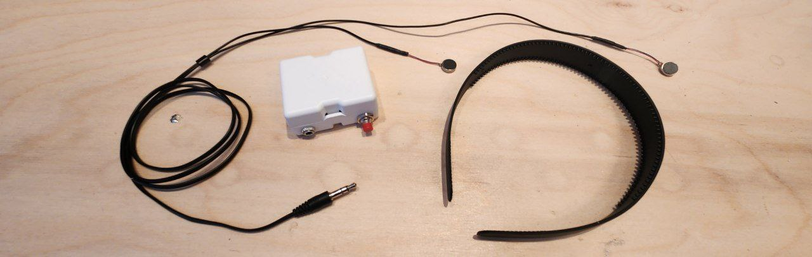

Inspired by the [Patstrap](https://github.com/danielfvm/Patstrap) project by [danielfvm](https://github.com/danielfvm).

# PatMe in VR, Haptic Feedback for VRChat

Bridges VRChat's OSC avatar parameters to a Bluetooth LE haptic device, so your friends can **pat you in VR**. The host app is written in Rust; the device firmware is an Arduino (ESP32) sketch; build instructions will be provided.

- **Input**: OSC messages with addresses
  - `/avatar/parameters/PatMe/Intensity` from Expression Menu 
  - `/avatar/parameters/PatMe/<id>` from Contact Receivers, where `id` is 0, 1 and so on
- **Processing**: Values are time-smoothed and compacted into a small,
  fixed-size haptic state.
- **Output**: The current haptic state is sent over BLE to the PatMe device in equal periods of time.

## Host application configuration

- **OSC bind address**
  - Flag: `--osc-port <PORT>`
  - Env: `PATME_OSC_PORT`
  - Default: `9001`

- **Haptics count (number of vibros)**
  - Flag: `--haptics-count <N>`
  - Env: `PATME_HAPTICS_SIZE`
  - Default: `2`

- **Send interval (ms)**
  - Flag: `--send-interval-ms <MS>`
  - Env: `PATME_SEND_INTERVAL_MS`
  - Default: `30`

- **Headless mode without GUI**
  - Flag: `--headless`

## Notes

- The host smooths incoming parameters with a decay filter and sends compacted float values to the device BLE characteristic.
- BLE service/characteristic UUIDs are defined in the firmware and matched by the host: see [firmware/firmware.ino](firmware/firmware.ino) and [src/ble.rs](src/ble.rs).

