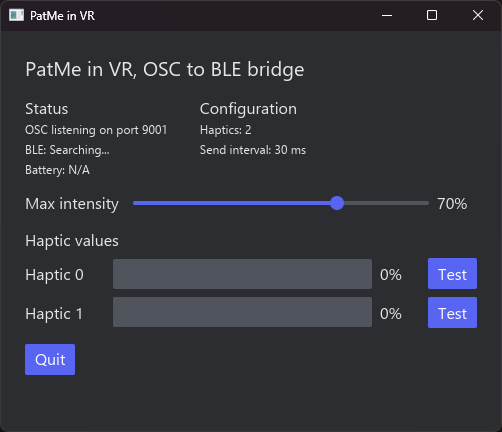
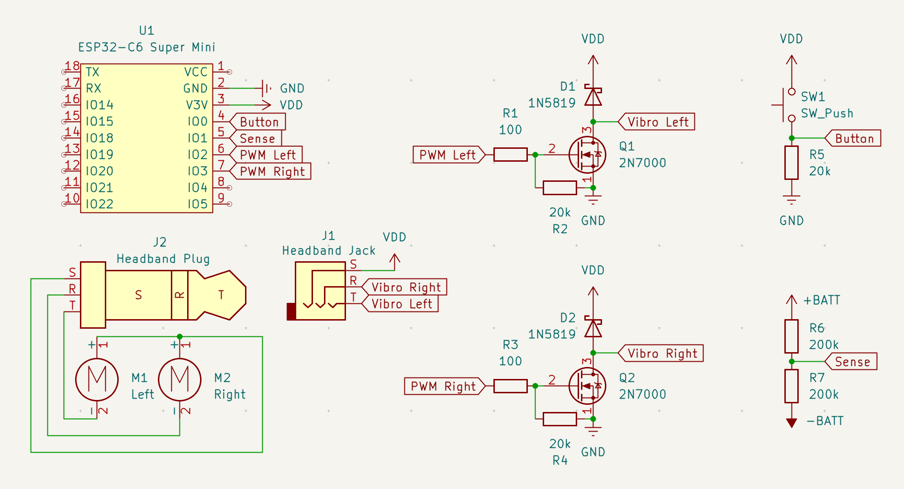

# PatMe in VR


PatMe is a small wearable that turns VRChat headpats into real vibration feedback. It has two motors, connects over Bluetooth LE, and is driven by an ESP32-C6 Super Mini. The host application is written in Rust; the firmware is an Arduino sketch.

> PatMe is an early-stage hardware project. The current host release targets Windows, and the hardware and firmware may still change.

I built it with two goals in mind:

- **Easy to assemble.** The ESP32-C6 Super Mini variant I used has a built-in battery charger, which keeps the device simple and the part count low.
- **Energy efficient.** BLE uses less power than Wi-Fi, and MOSFETs waste less power than BJTs when driving the motors.

## How it works

VRChat sends Contact Receiver and Expression Menu values over OSC. The host application smooths those values and sends the current motor intensities to the wearable over BLE.



The application also shows the OSC and BLE status, battery level, and current haptic values. The **Test** buttons are useful when checking a new build.

## Getting it running

1. Assemble the device using the [schematic](#hardware).
2. Follow the [firmware flashing instructions](firmware/README.md#building-and-flashing).
3. Enable OSC in VRChat and add float avatar parameters as needed:

   - `PatMe/L` controls the left motor and is an alias for channel `0`.
   - `PatMe/R` controls the right motor and is an alias for channel `1`.
   - `PatMe/<num>` controls any zero-based numeric channel, for example `PatMe/0`, `PatMe/1`, or `PatMe/2`.
   - `PatMe/Intensity` sets the maximum output intensity.

   Parameter values should be between `0.0` and `1.0`. Numeric channel indices must be lower than `--haptics-count`; the default channel count is `2`.

4. Download `patme-in-vr.exe` from the [latest release](https://github.com/euav/patme-in-vr/releases/latest) and run it.

The application uses OSCQuery to advertise an automatically assigned OSC port to VRChat and looks for a BLE device named `PatMe-in-VR`. For now, the original [Patstrap VRChat instructions](https://github.com/danielfvm/Patstrap#vrchat) are a useful reference for setting up Contact Receivers.

### Command-line options

| Option | Environment variable | Default |
|---|---|---:|
| `--osc-port <PORT>` | `PATME_OSC_PORT` | automatic |
| `--haptics-count <N>` | `PATME_HAPTICS_COUNT` | `2` |
| `--send-interval-ms <MS>` | `PATME_SEND_INTERVAL_MS` | `30` |
| `--headless` | — | off |

For example:

```powershell
.\patme-in-vr.exe --headless
```

When `--osc-port` or `PATME_OSC_PORT` is set, the application uses that exact port and exits if it cannot be bound. Without an override, Windows assigns an available port automatically.

## Hardware



The reference build uses:

- ESP32-C6 Super Mini
- 2 × vibration motors
- 2 × 2N7000 N-channel MOSFETs
- 2 × 1N5819 Schottky diodes
- 2 × 100 Ω, 3 × 20 kΩ, and 2 × 200 kΩ resistors
- A momentary push button
- A 3.5 mm TRS jack and plug for the detachable headband
- A battery suitable for the board

The default firmware uses GPIO 0 for restart/wake, GPIO 1 for battery sensing, and GPIOs 2 and 3 for the left and right motors. More firmware details, including the BLE protocol, are in [`firmware/README.md`](firmware/README.md).

Different ESP32-C6 Super Mini boards can have different battery-charging circuits. Check your exact board before connecting a cell, and take the usual precautions when building a battery-powered wearable.

## Troubleshooting

**The application cannot find the device.** Check that Bluetooth is enabled, then power-cycle the PatMe device or pull GPIO 0 high to wake it. Make sure it is not already connected to another host.

**OSC is active, but the motors do not respond.** Check the avatar parameter names and make sure they send float values between `0.0` and `1.0`. Try the GUI's **Test** buttons: if they work, the problem is probably in the VRChat setup rather than BLE or the hardware.

**The battery level is `N/A`.** Battery reporting is optional. This is expected if the Battery Service or battery-sense circuit is not available.

**OSC is enabled in VRChat, but the application receives no values.** Make sure Windows Firewall allows the application to use the local network. OSCQuery uses mDNS to tell VRChat which automatically assigned port to use.

## Building the host application

Install Rust 1.85 or later, then run:

```console
cargo build --release
```

The executable will be written to `target/release/`. During development, `cargo run` is usually enough.

## Project notes

See [`CHANGELOG.md`](CHANGELOG.md) for release history and [`TODO.md`](TODO.md) for ideas I would still like to explore.

PatMe was inspired by Daniel F. V. Martins's [Patstrap](https://github.com/danielfvm/Patstrap) project and is available under the [MIT License](LICENSE).
